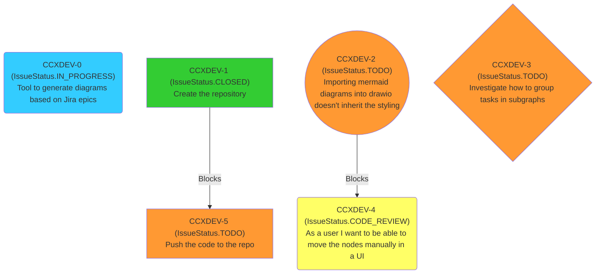

# Jira to Mermaid

This tool lets you represent Jira tasks as mermaid diagrams. For example,
the CSV file [epic-1.csv](examples/epic-1.csv) is represented as:


## How tu run

You don't need any dependencies apart from Python. I've used Python 3.11, but any version
< 3.10 should work.

Running the tool is as simple as this:
```
❯ ./csv-to-mermaid.py -h
usage: csv-to-mermaid.py [-h] [--csv_file CSV_FILE] [--ignore_links [IGNORE_LINKS ...]]

Generate Mermaid code from a Jira CSV file.

options:
  -h, --help            show this help message and exit
  --csv_file CSV_FILE   Path to the Jira CSV file. Default is 'issues.csv'
  --ignore_links [IGNORE_LINKS ...]
                        Links to ignore. Default is '[Cloners]'
```

You can specify an input CSV and some links to ignore. By default it ignores the
`Cloners`  because I personally find them quite useless.

The code is then printed to the stdout, so you can retrieve it with `pbcopy` or
pipe it into a file:

```
❯ ./csv-to-mermaid.py > generated_mermaid_code.mmd
```

## Format of the CSV file

In order to get a CSV out of your tasks, you may need to visit {YOUR_JIRA_URL}/issues/
and apply some filters. Then just click on "Export" and download the CSV.

The columns this tool needs are:
- Issue key
- Issue Type
- Status
- Summary

Any column like `{Outward|Inward} issue link ({TYPE})` will be treated as an in/out
link of type `TYPE`. You can better understand this by checking the
[epic-1.csv](examples/epic-1.csv) file.
