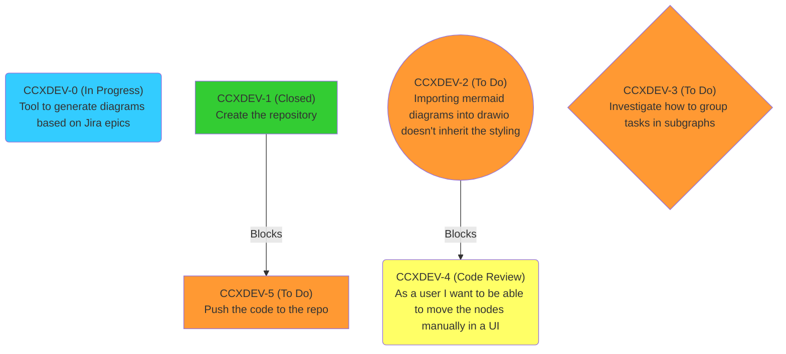

# Jira to Mermaid

This tool lets you represent Jira tasks as mermaid diagrams. For example,
the CSV file [epic-1.csv](examples/epic-1.csv) is represented as:


## How tu run

You don't need any dependencies apart from Python. I've used Python 3.11, but any version > 3.10 should work.

Running the tool is as simple as this:
```
❯ ./csv-to-mermaid.py --help
usage: csv-to-mermaid.py [-h] [--csv_file CSV_FILE] [--ignore_links IGNORE_LINKS] [--task__shape_left TASK__SHAPE_LEFT] [--task__shape_right TASK__SHAPE_RIGHT]
                         [--bug__shape_left BUG__SHAPE_LEFT] [--bug__shape_right BUG__SHAPE_RIGHT] [--spike__shape_left SPIKE__SHAPE_LEFT] [--spike__shape_right SPIKE__SHAPE_RIGHT]
                         [--default__shape_left DEFAULT__SHAPE_LEFT] [--default__shape_right DEFAULT__SHAPE_RIGHT] [--todo__color TODO__COLOR] [--closed__color CLOSED__COLOR]
                         [--in_progress__color IN_PROGRESS__COLOR] [--code_review__color CODE_REVIEW__COLOR] [--review__color REVIEW__COLOR] [--default__color DEFAULT__COLOR]
                         [--graph_direction GRAPH_DIRECTION]

Generate Mermaid code from a Jira CSV file.

options:
  -h, --help            show this help message and exit
  --csv_file CSV_FILE   Path to the Jira CSV file (default: issues.csv)
  --ignore_links IGNORE_LINKS
                        Links to ignore (default: ['Cloners'])
  --task__shape_left TASK__SHAPE_LEFT
                        The task node's left shape (default: [)
  --task__shape_right TASK__SHAPE_RIGHT
                        The task node's right shape (default: ])
  --bug__shape_left BUG__SHAPE_LEFT
                        The bug node's left shape (default: (()
  --bug__shape_right BUG__SHAPE_RIGHT
                        The bug node's right shape (default: )))
  --spike__shape_left SPIKE__SHAPE_LEFT
                        The spike node's left shape (default: {)
  --spike__shape_right SPIKE__SHAPE_RIGHT
                        The spike node's right shape (default: })
  --default__shape_left DEFAULT__SHAPE_LEFT
                        The default node's left shape (default: ()
  --default__shape_right DEFAULT__SHAPE_RIGHT
                        The default node's right shape when the task is not a task, spike or bug (default: ))
  --todo__color TODO__COLOR
                        The TODO node color (default: #ff9933)
  --closed__color CLOSED__COLOR
                        The CLOSED node color (default: #33cc33)
  --in_progress__color IN_PROGRESS__COLOR
                        The IN PROGRESS node color (default: #33ccff)
  --code_review__color CODE_REVIEW__COLOR
                        The CODE REVIEW node color (default: #ffff66)
  --review__color REVIEW__COLOR
                        The REVIEW node color (default: #ffcc00)
  --default__color DEFAULT__COLOR
                        The default node color (default: #f9f)
  --graph_direction GRAPH_DIRECTION
                        The graph direction. Must be one of 'TD' or 'LR' (default: TD)
```

You can specify an input CSV and some links to ignore. By default it ignores the
`Cloners`  because I personally find them quite useless.

The code is then printed to the stdout, so you can retrieve it with `pbcopy` or
pipe it into a file:

```
❯ ./csv-to-mermaid.py > generated_mermaid_code.mmd
```

## Format of the CSV file

In order to get a CSV out of your tasks, you may need to visit {YOUR_JIRA_URL}/issues/
and apply some filters. Then just click on "Export" and download the CSV.

The columns this tool needs are:
- Issue key
- Issue Type
- Status
- Summary

Any column like `{Outward|Inward} issue link ({TYPE})` will be treated as an in/out
link of type `TYPE`. You can better understand this by checking the
[epic-1.csv](examples/epic-1.csv) file.
